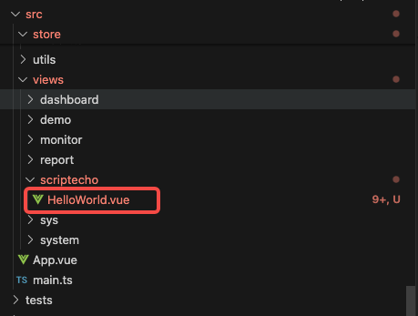
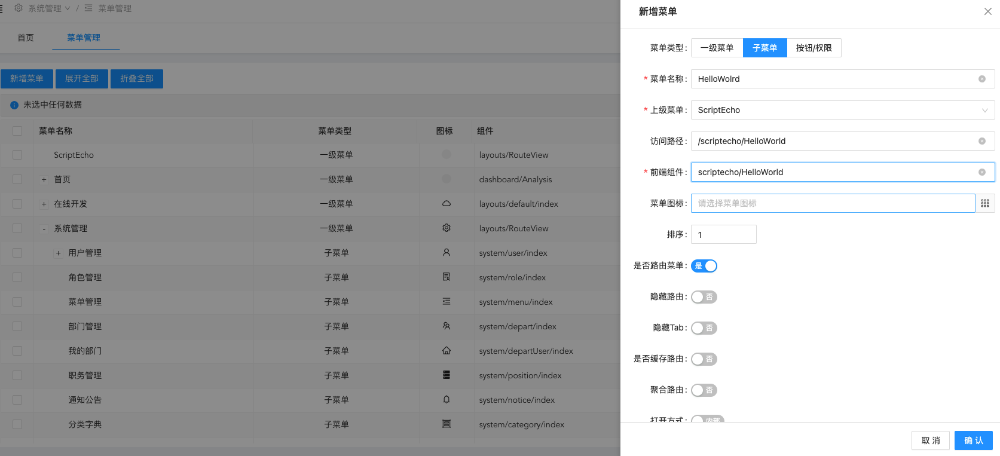
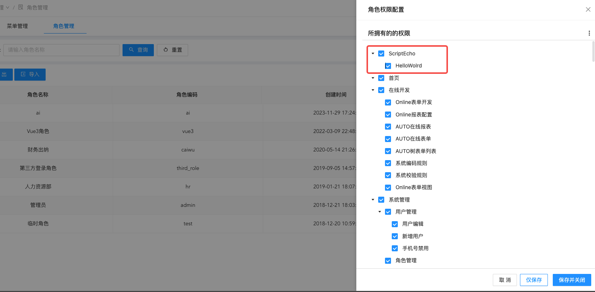

ScriptEcho Jeecg(AntDesignVue)的模板项目
===============

## 安装与使用

- 获取项目代码

```bash
git clone https://github.com/ScriptEcho-ai/ScriptEch-JeecgTemplate.git
```

- 安装依赖

```bash
yarn install

```

- 运行

```bash
yarn serve
```


- 构建

```bash
yarn build
```


## 添加页面

1. 访问 http://localhost:3100 进行登录（admin 123456）

2. 创建页面HelloWorld.vue到src/view/scriptecho下


3. 进入系统设置-菜单管理页面

4. 在ScriptEcho菜单下添加子菜单HelloWolrd


5. 进入系统设置-角色管理页面

6. 点击管理员的授权按钮，勾选该菜单权限


7. 访问 http://localhost:3100/scriptecho/HelloWorld